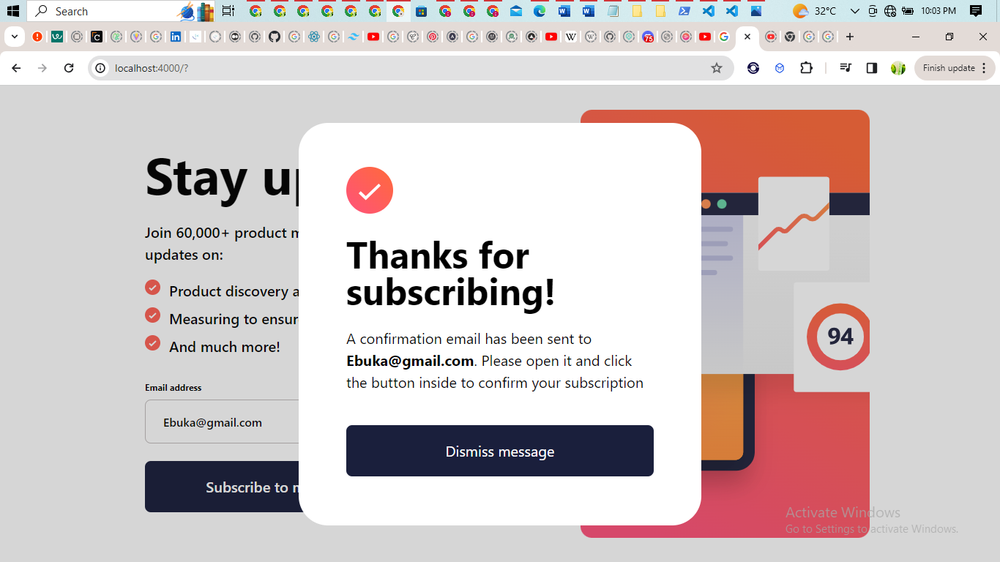

This is a solution to the [Newsletter sign-up form with success message challenge on Frontend Mentor](https://www.frontendmentor.io/challenges/newsletter-signup-form-with-success-message-3FC1AZbNrv). Frontend Mentor challenges helps me improve my coding skills by building realistic projects.





Built with
# React + TypeScript + Vite

This template provides a minimal setup to get React working in Vite with HMR and some ESLint rules.

Currently, two official plugins are available:

- [@vitejs/plugin-react](https://github.com/vitejs/vite-plugin-react/blob/main/packages/plugin-react/README.md) uses [Babel](https://babeljs.io/) for Fast Refresh
- [@vitejs/plugin-react-swc](https://github.com/vitejs/vite-plugin-react-swc) uses [SWC](https://swc.rs/) for Fast Refresh

## Expanding the ESLint configuration

If you are developing a production application, we recommend updating the configuration to enable type aware lint rules:

- Configure the top-level `parserOptions` property like this:

```js
export default {
  // other rules...
  parserOptions: {
    ecmaVersion: 'latest',
    sourceType: 'module',
    project: ['./tsconfig.json', './tsconfig.node.json'],
    tsconfigRootDir: __dirname,
  },
}
```

- Replace `plugin:@typescript-eslint/recommended` to `plugin:@typescript-eslint/recommended-type-checked` or `plugin:@typescript-eslint/strict-type-checked`
- Optionally add `plugin:@typescript-eslint/stylistic-type-checked`
- Install [eslint-plugin-react](https://github.com/jsx-eslint/eslint-plugin-react) and add `plugin:react/recommended` & `plugin:react/jsx-runtime` to the `extends` list

One key thing I learned was how to build a modal from scratch.

Thanks for reading